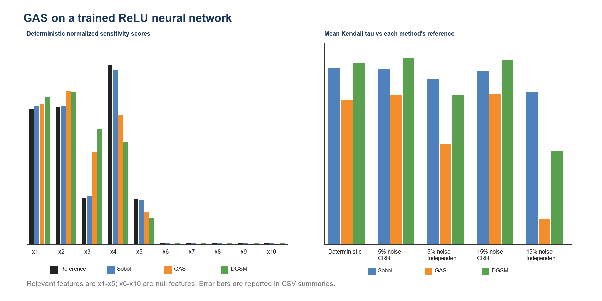

# GAS for Neural Networks

This module is a minimal, reproducible experiment applying **Global Activity
Scores (GAS)** to a trained ReLU neural network.

The purpose is not to claim that GAS is universally better than Sobol indices
or gradient-based sensitivity measures. The experiment asks a narrower
question:

> Can GAS recover globally influential neural-network inputs, and how does its
> stability depend on the random-number protocol when model evaluations are
> noisy?

## Example

The data-generating function is the 10-dimensional Friedman benchmark

\[
Y=10\sin(\pi X_1X_2)+20(X_3-0.5)^2+10X_4+5X_5,
\]

with independent inputs \(X_i\sim U(0,1)\). Only `x1`--`x5` are relevant;
`x6`--`x10` are null features. A two-hidden-layer ReLU MLP is trained from
scratch in NumPy and then treated as a black-box model.

Three global sensitivity estimators are compared at similar evaluation budgets:

- Sobol total-effect indices: 6,144 model evaluations;
- GAS with split Gauss--Legendre quadrature: 5,184 evaluations;
- DGSM with central finite differences: 5,120 evaluations.

Each method is evaluated under deterministic predictions and Gaussian output
noise at 5% or 15% of the prediction standard deviation. For noisy evaluations,
the baseline and perturbed calls use either common random numbers (CRN) or
independent noise.

## Main result

The trained MLP reaches a test \(R^2\) of approximately 0.992. GAS, Sobol, and
DGSM all recover the five relevant features in deterministic evaluation.

CRN preserves the relevant-feature recovery of all three methods under both
noise levels. Independent noise strongly degrades finite-difference methods,
especially GAS at 15% noise. This result supports the following limited
conclusion:

> GAS can be used for global input sensitivity of a trained neural network, but
> its apparent noise robustness depends critically on coupling paired random
> evaluations. GAS is not automatically immune to stochastic evaluation noise.



The CSV files compare each low-budget estimator with a high-budget deterministic
reference for the **same method**. This avoids treating Sobol, GAS, and DGSM as
identical estimands.

## Run the experiment

```bash
python -m pip install -r requirements.txt
python neural_network_gas_demo.py
```

To change the number of repeated sensitivity runs:

```bash
python neural_network_gas_demo.py --repeats 20
```

The script writes the following files to `results/`:

- `model_metrics.json`: MLP fit and evaluation budgets;
- `reference_scores.csv`: high-budget method-specific references;
- `stability_summary.csv`: rank stability, score error, and top-five recovery;
- `method_scores.csv` and `mean_scores.csv`: raw and aggregated scores;
- `gas_eigenvalues.csv`: GAS eigenvalue estimates and retained dimension;
- `gas_neural_network_demo.png`: summary figure.

## Recommended next experiment

The present study uses additive output noise. A stronger neural-network study
should next replace it with Monte Carlo dropout or stochastic data augmentation,
compare CRN and independent masks, and examine nonsmooth or discontinuous model
behavior under matched model-evaluation budgets.

